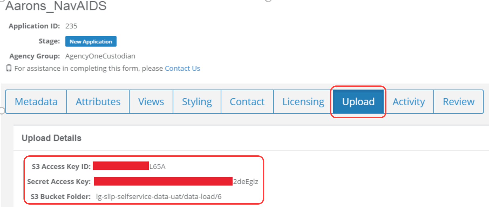

# SLIP-Self-Service-Toolkit
The aim here is to provide generic scripts that data custodians will be able to easily understand and customise for their own organisational requirements. If you have a particular need or require further help with automating data ingestion into SLIP self-service please get in contact with us by emailing who@who.com.au. If you would like to help contribute to improving the tool kit please also get in touch.

To get you started we have created basic scripts that you can tailor to automate the following processes: 
- Exporting data from common enterprise spatial environments into a supported SLIP self-service format. 
- Automate the 'zipping up' of data ready for uploading into self-service. 
- Tools and script to help upload data into the self-service environment. 
- Finally, the basics at setting up batch scheduling using either Windows and Linux environments 
 
These scripts may not be suitable for users who only manage a few datasets that are infrequently updated. For these users, we recommend using the self-service web form to manage any data updates.

However, we recognised that some data custodians manage multiple datasets that are constantly being updated and would like a level of automation to keep their data in SLIP up to date. For these technical users, we have provided the following scripting options.

# Automate the exporting of your data
### *Option1. (ESRI SDE)*
Data custodians that have access to ArcGIS can use the ESRI's arcpy python library to automate exporting of SDE datasets to either shapefile or file geodatabase. 

The following code provides two function to export a SDE featureclass to either filegeodatabase or shapefile:
```python
import arcpy
import os
import shutil

# Function Name: sde2fgdb()
# Purpose:
#   Function to export a SDE feature class to a file geodatabase.
#   The function will return location of the file geodatabase. ie C:\AARON_DATA\LGATE071.gdb
#          
# usage:
#      sde2fgdb <SDE_Connection> <SDE_FC_Name> <path_to_output_fGDB> <fGDB_Name> <Output_FC_Name>
def sde2fgdb(sde_connection,featureclass_name,output_path,fgdb_name,outFCname):
    #establish sde connection workspace
    arcpy.env.workspace = sde_connection
    #does the geodatabase exist if so delete it
    if (os.path.isdir(output_path+'\\'+fgdb_name+'.gdb')== True):
        shutil.rmtree(output_path+'\\'+fgdb_name+'.gdb')
    #create a version 10 FileGDB. Note Selfservice only supports FileGDB <10.3
    arcpy.CreateFileGDB_management(output_path, fgdb_name,"10.0")
    #Export the sde featureclass to the filegdb
    arcpy.FeatureClassToFeatureClass_conversion(sde_connection+'//'+featureclass_name, 
                                            output_path+'\\'+fgdb_name+'.gdb', 
                                            outFCname)
    #drop SDE connection 
    arcpy.ClearWorkspaceCache_management()
    return output_path+'\\'+fgdb_name+'.gdb'

# Function Name: sde2shp()
# Purpose:
#   Function to export a SDE feature class to a ESRI shapefile
#   The function will return location of the file geodatabase. ie C:\AARON_DATA\LGATE071.shp
#          
# usage:
#      sde2shp <SDE_Connection> <SDE_FC_Name> <output_path> <Output_shapefile_name>
def sde2shp(sde_connection,featureclass_name,output_path,outputSHPname):
    #establish sde connection workspace
    arcpy.env.workspace = sde_connection
    #does the shapefile exists is so delete it
    if arcpy.Exists(output_path+'//'+outputSHPname):
        arcpy.Delete_management(output_path+'//'+outputSHPname)
    #Export the sde featureclass to the esri shapefile
    arcpy.FeatureClassToFeatureClass_conversion(featureclass_name, 
                                            output_path, 
                                            outputSHPname)
    #drop SDE connection 
    arcpy.ClearWorkspaceCache_management()
    return output_path+'\\'+outputSHPname


# Test fuction calls
#test sde2fgdb <SDE_Connection> <SDE_FC_Name> <path_to_output_fGDB> <fGDB_Name> <Output_FC_Name>
print sde2fgdb(r'C:\AARON_DATA\Connection to PEAS71 - DISS - SDE.sde','GDB.W_IMAGERY_METADATA',r'C:\AARON_DATA','LGATE071','LGATE071')

#test sde2shp <SDE_Connection> <SDE_FC_Name> <output_path> <shapefile_Name>
print sde2shp(r'C:\AARON_DATA\Connection to PEAS71 - DISS - SDE.sde','GDB.W_IMAGERY_METADATA',r'C:\AARON_DATA','LGATE071.shp')
```

### *Option2. PostGIS|PostgreSQL*
The [pgsql2shp](https://postgis.net/docs/using_postgis_dbmanagement.html) is usally the most efficeint tool to extract data out of PostGIS.

An alternative to pgsql2shp is using the open source utility [org2org](http://www.gdal.org/ogr2ogr.html).

The ogr2ogr command below is example how to extract a single Roads dataset from PostGIS to ESRI Shapefile
>ogr2ogr -f "ESRI Shapefile" roads.shp PG:"host=myhost user=myloginname dbname=mydbname password=mypassword" "roads" 

To export all your PostGIS dataset into folder call mydata you can use a simular command the as follows
>ogr2ogr -f "ESRI Shapefile" mydata PG:"host=myhost user=myloginname dbname=mydbname password=mypassword"

To export from POSTGIS to filegeodatabase make the following modification to your ogr2ogr command

>ogr2ogr -f "FileGDB" myData.gdb PG:"host=my_host user=my_user_name dbname=my_db_name password=my_password" -sgl "SELECT * from MyDATA" -a_srs "EPSG:4283" -lco FEATURE_DATASET=my_FeatureClass

### *Option3. MySQL orMSSQL*
Simular to the postGIS ogr2ogr commands data can exported from 

>ogr2ogr -f "MySQL" MYSQL:"mydb,host=myhost,user=mylogin,password=mypassword,port=3306" -nln "myDataLayerName" -a_srs "EPSG:4283" output.shp

Below example exports a shapegile from 
>ogr2ogr -f "ESRI Shapefile" "Output.shp" "MSSQL:server=MYBOX\SQLEXPRESS;database=Staging;trusted_connection=yess" -t_srs EPSG:28355 -sql "Select * FROM dbo.localitieslgate_008_1 Where name like 'CAN%'" -overwrite 

### *Option3. FME Workbench*

# Automate the zipping of your datasets ready for upload.
### *Option1. (Windows)


### *Option2. (Linux/MacOS)
Modern distributions of linux have zip support built in.
To compress a shapefile using the built-in zip command is as simple as running 

> zip mySLIPData.zip roads.shp roads.shx roads.prj roads.dbf

To compress all the contents of a fileGeodatabase use the following command
> zip -r mySLIPData.zip roads.gdb/*

### *Option3. (python)
Python has a standard module called [zipfile](https://docs.python.org/2/library/zipfile.html) that provides functionality to create compressed zip files.

The following snippet demonstrates how to you can use this module to compress either a shapefile or filegeodata ready for uploading into selfservice.
```python
import os
import shutil
import zipfile
# Creates a zip file containing the input shapefile
#   inShp: Full path to shapefile to be zipped
#   Delete: Set to True to delete shapefile files after zip
def ZipShp (inShp, Delete = True):
    #List of shapefile file extensions
    extensions = [".shp",".shx",".dbf",".sbn",".sbx",".fbn",".fbx",".ain",".aih",".atx",".ixs",".mxs",".prj",".xml",".cpg",".shp.xml"]
    #Directory of shapefile
    inLocation = os.path.dirname (inShp)
    #Base name of shapefile
    inName = os.path.basename (os.path.splitext (inShp)[0])
    #Create zipfile name
    zipfl = os.path.join (inLocation, inName + ".zip")
    #Create zipfile object
    ZIP = zipfile.ZipFile (zipfl, "w")
    #Empty list to store files to delete
    delFiles = []
    #Iterate files in shapefile directory
    for fl in os.listdir (inLocation):
        #Iterate extensions
        for extension in extensions:
            #Check if file is shapefile file
            if fl == inName + extension:
                #Get full path of file
                inFile = os.path.join (inLocation, fl)
                #Add file to delete files list
                delFiles += [inFile]
                #Add file to zipfile
                ZIP.write (inFile, fl)
                break
    #Delete shapefile if indicated
    if Delete == True:
        for fl in delFiles:
            os.remove (fl)
    #Close zipfile object
    ZIP.close()
    #Return zipfile full path
    return zipfl

# Creates a zip file containing the contents of a filegeodatabase
def Zipfgdb(inFileGDB, Delete = True):
    #Directory of file geodatabase
    inLocation = os.path.dirname (inFileGDB)
    #Base name of shapefile
    inName = os.path.basename (os.path.splitext(inFileGDB)[0])
    #Create the zipfile name 
    zipfl = os.path.join (inLocation, inName + ".zip")
    #Create zipfile object
    ZIP = zipfile.ZipFile (zipfl, "w")
    #Iterate files in shapefile directory
    for fl in os.listdir (inFileGDB):
        #Get full path of file
        inFile = os.path.join (inFileGDB, fl)
        #Add file to zipfile. exclude any lock files
        if os.path.splitext(fl)[1][1:] <> 'lock':
            ZIP.write(inFile,fl)
    #Delete filegeodatabase if indicated
    if Delete == True:
        shutil.rmtree(inFileGDB)
    #Close zipfile object
    ZIP.close()
    #Return zipfile full path
    return zipfl

#test zipping a shapefile. The output zip files is 
print ZipShp(r'D:\selfservice\shapefile\DOT_Vavids.shp', False)
#test zipping a geodatabase.
print Zipfgdb(r'D:\selfservice\filegeodatabase.gdb', False)
```


# Tools to automate uploading data directly into self-service
### *Option1. (AWS CLI Tool)*

If you’re not a programmer but you're comfortable using either a Linux terminal or windows command prompt then the AWS CLI tool maybe the right tool for you. To get started with AWS CLI download it from
https://aws.amazon.com/cli/

Once the AWS CLI has been installed on your operating system, open either a Linux terminal or windows command prompt to set up the AWS credentials. Your credentials can be located in the self-service upload tab as shown below in the form of an access key and secret key.  



Each agency will have their own unique credentials and it's the responsibility of each data custodians to keep these credentials secure. If you believe your credentials have been compromised it is important to contact us as soon as possible so we can issue new credentials.

For the purpose of a simple demonstration we will create a single profile called 'my_selfservice_upload_user' to store the credentials. 
In the case, you have a number of different credentials you can uses multiple profile names to switch between the different credentials.

> aws configure --profile my_selfservice_upload_user

enter your provide AWS access key Id, followed by your secret access key. 

Set the AWS region to

> ap-southeast-2 

Leave the Default output to none.

Once the credential have been configured the command to upload a local file to s3 l 

>aws s3 cp c:\temp\roads.zip s3://llg-slip-selfservice-data-uat/data-load/6/roads.zip --profile my_selfservice_upload_user --debug 2>debug_uatuploads2.log

### *Option2. ( python boto3 library )*
The [boto3](https://github.com/boto/boto3) python module will enable you to write your own python scripts that can handle the uploading of your data into your designated self service s3 bucket. 

Boto3 isn't a standard python module so you will need to install the boto3 module before the flowing boto3 script will work. The easiest way of installing custom python module is by installing pip.

## Installing PIP
Download [get-pip.py](https://bootstrap.pypa.io/get-pip.py) to a folder on your computer. Open a command prompt window and navigate to the folder containing get-pip.py. Then run 
>python get-pip.py 

This will install pip.
Verify a successful pip installation by opening a command prompt window and navigating to your Python installation's script directory (default is C:\Python27\Scripts or C:\python27\Argcis10.3\Scripts). Type pip freeze from this location to launch the Python interpreter.
pip freeze displays the version number of all modules installed in your Python non-standard library;

>c:\Python27\ArcGIS\Scripts\pip.exe freeze

Below is example how to use boto3 to upload your data to AWSs3

```python
import boto3
# It is not recommended to hard code you credentials into your code
#session = boto3.Session(aws_access_key_id=None, aws_secret_access_key=None, region='ap-southeast-2')

# Use 'aws configure --profile SLIP_SelfService' to create a profile with your s3 credentials.
session = boto3.Session(profile_name='SLIP_SelfService')

def UploadFile(source_file, bucket, key):
    s3_client = session.client('s3')
    s3_client.upload_file(source_file, bucket, key)
    file_url = '{0}/{1}/{2}'.format(s3_client.meta.endpoint_url, bucket, key)
    return file_url
#UploadFile (<localFile>,<yours3bucket>,<s3key_or_name>)
print UploadFile(r'D:\selfservice\myData2.zip','lg-slip-selfservice-data-uat','data-load/6/s3_upload.zip')
```


# Setting up batch scheduling
### *Option1. (Windows)*

### *Option2. (Linux)*


